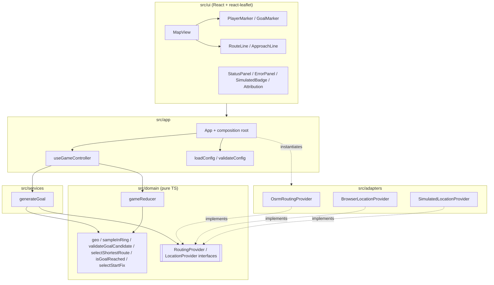
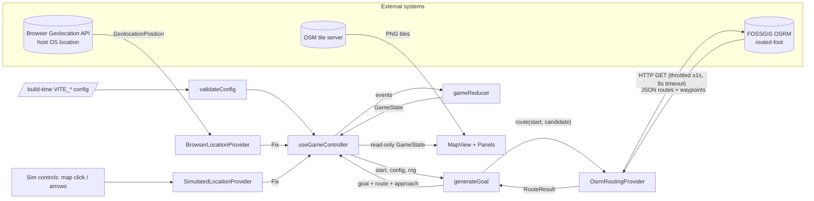
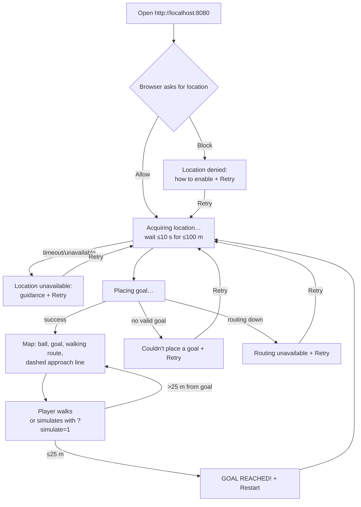

# Architecture (target)

The **target** Part 1 architecture, following `DECISIONS.md` and `DESIGN.md`. Nothing here is implemented yet.

## Runtime topology

- **Inside Docker Compose:** one service, `web` — unprivileged nginx serving the static Vite build on `localhost:8080`.
- **External systems** (outside our control; called directly by the user's browser):
  - **Browser Geolocation API** → host OS location services.
  - **OSM tile server** `tile.openstreetmap.org` (images).
  - **FOSSGIS OSRM** `routing.openstreetmap.de/routed-foot` (JSON, CORS `*`, max 1 req/s).
- No backend, database or API keys.

## 1. Module dependency flow



## 2. Data flow



## 3. Game state machine

```mermaid
stateDiagram-v2
  [*] --> idle
  idle --> acquiringLocation: START (new session)
  acquiringLocation --> generatingGoal: START_FIX_SELECTED (≤100 m or best after 10 s)
  acquiringLocation --> locationError: LOCATION_FAILED (denied / unavailable / timeout / unsupported)
  generatingGoal --> playing: GOAL_READY (goal + route + approach)
  generatingGoal --> goalGenerationFailed: GOAL_FAILED (attempts exhausted)
  generatingGoal --> routingError: ROUTING_FAILED (provider unavailable)
  playing --> playing: POSITION_UPDATED (distance > 25 m)
  playing --> won: POSITION_UPDATED (distance ≤ 25 m) [latch]
  playing --> locationError: LOCATION_FAILED
  locationError --> acquiringLocation: RETRY
  goalGenerationFailed --> acquiringLocation: RETRY
  routingError --> acquiringLocation: RETRY
  won --> acquiringLocation: RESTART
  playing --> acquiringLocation: RESTART
  note right of won: terminal for the session;<br/>further positions ignored
  note right of playing: goal is immutable here
```



Events carrying a stale `sessionId` are ignored in every state.

## 4. Goal-generation sequence

```mermaid
sequenceDiagram
  autonumber
  participant C as useGameController
  participant G as generateGoal (service)
  participant D as domain rules
  participant R as OsrmRoutingProvider
  participant O as FOSSGIS OSRM (external)

  C->>G: generateGoal(start, config, rng, signal)
  loop attempt = 1..maxAttempts (5)
    G->>D: sampleInRing(start, 300 m, 800 m, rng)
    D-->>G: candidate
    G->>R: route(start, candidate, 'walking', signal)
    R->>R: wait for throttle slot (≥1 s since last request)
    R->>O: GET /routed-foot/route/v1/foot/{start};{candidate}?alternatives=true&overview=full&geometries=geojson
    alt code = Ok
      O-->>R: routes[], waypoints[] (snapped locations + snap distances)
      R-->>G: RouteResult {candidates, snappedFrom, snappedTo}
      G->>D: selectShortestRoute(candidates)
      G->>D: validateGoalCandidate(start, result, config)
      alt valid (snap ≤150 m, snapped goal in 300–800 m, route ≤1,600 m)
        G-->>C: GOAL_READY {goal=snappedTo, route, approach}
      else invalid
        Note over G: reject candidate, next attempt
      end
    else code = NoRoute
      R-->>G: RoutingError(noRoute) → next attempt
    else timeout / network / 5xx / 429
      R-->>G: RoutingError(unavailable) (after 1 retry, P1)
      G-->>C: ROUTING_FAILED
    end
  end
  G-->>C: GOAL_FAILED (attempts exhausted)
```

## 5. Main user journey



## Deployment view
- `Dockerfile`: stage 1 `node:<pinned>-alpine` → `npm ci` → `npm run build` (with `VITE_*` build args); stage 2 `nginxinc/nginx-unprivileged:<pinned>-alpine` serving `/usr/share/nginx/html` on 8080.
- `docker-compose.yml`: service `web`, `build.args` from `.env`/defaults, `ports: 8080:8080`, `healthcheck`, `restart: unless-stopped`.
- `nginx.conf`: SPA fallback, cache headers, gzip, security headers (CSP with the OSRM and tile hosts).

## Scaling notes (documented, not built)
- Static frontend → CDN; horizontally trivial.
- The bottleneck is the public OSRM (1 req/s) → self-hosted OSRM service in Compose/Kubernetes, same API.
- Tiles → a commercial or self-hosted tile service for production traffic.
- Part 2 → add a game server that runs the same domain reducer authoritatively (see `DESIGN.md`).
